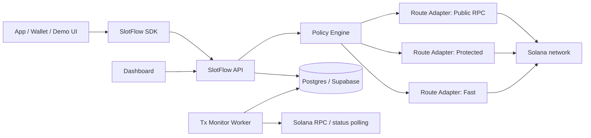
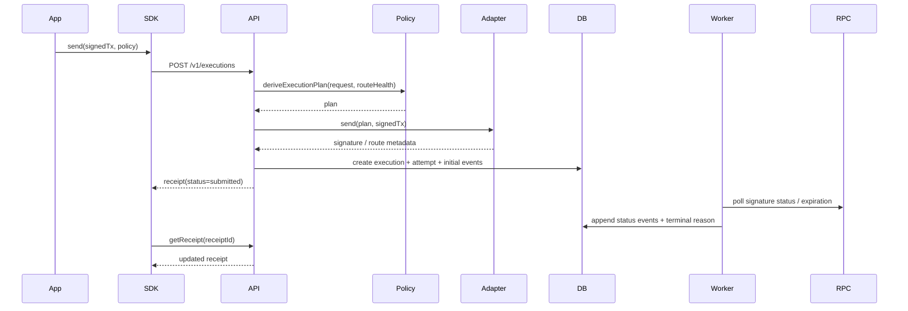
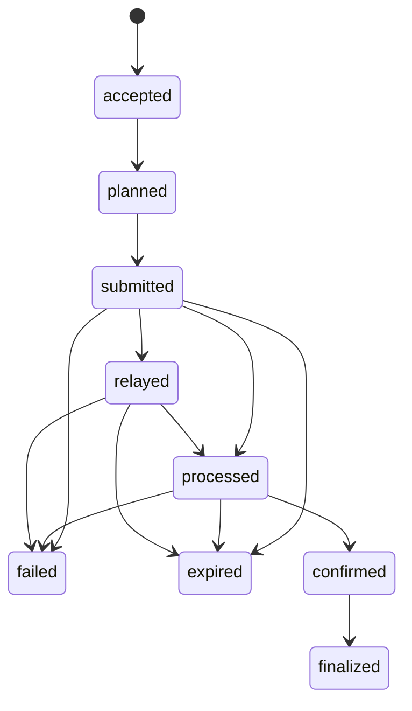

# SlotFlow Architecture

이 문서는 SlotFlow MVP를 바로 구현할 수 있도록 시스템 경계, 책임 분리, 실행 흐름, 상태 머신을 정의한다.

---

## 1. 시스템 개요

SlotFlow는 **signed transaction을 받아 policy-based execution plan으로 번역하고,
route adapter를 통해 전송한 뒤, receipt와 상태 이벤트로 추적하는 오프체인 control plane**이다.

### 상위 구조



---

## 2. 권장 저장소 구조

```text
slotflow/
├─ apps/
│  ├─ dashboard/
│  ├─ demo-swap/
│  ├─ demo-payments/
│  └─ demo-fast-action/        # optional
├─ packages/
│  ├─ shared/
│  ├─ sdk/
│  ├─ policy-engine/
│  ├─ route-adapters/
│  └─ solana-utils/
├─ services/
│  └─ api/
├─ workers/
│  └─ tx-monitor/
├─ docs/
└─ .omx/plans/
```

### 책임 분리 원칙

- `packages/shared`: 타입/enum/DTO/validation schema
- `packages/sdk`: 앱이 직접 쓰는 client
- `packages/policy-engine`: policy → execution plan
- `packages/route-adapters`: path-specific send implementation
- `services/api`: orchestration entrypoint
- `workers/tx-monitor`: polling, transition, terminalization
- `apps/dashboard`: observability UI

---

## 3. 핵심 도메인 객체

| 객체 | 설명 |
| --- | --- |
| Execution Request | 앱이 SlotFlow에 보낸 1회성 실행 요청 |
| Derived Execution Plan | policy 평가 결과로 나온 실제 전송 계획 |
| Route Adapter | 특정 전송 path를 구현하는 플러그인 |
| Attempt | route를 통해 보낸 개별 시도 |
| Receipt | 현재 상태와 누적 이벤트를 보여주는 사용자-facing 결과 |
| Status Event | 상태 전이 기록 |
| Route Health Snapshot | adapter 사용 가능 여부/지연/보호 capability 등 |

---

## 4. 요청 라이프사이클



---

## 5. 정책 엔진 설계

정책 엔진은 단순 if/else가 아니라 **정책 선언 → 실행 계획 생성** 레이어여야 한다.

### 입력

- policy
- tx metadata (kind, value sensitivity, appId, fee cap)
- route health snapshot
- optional simulation / fee hints

### 출력: Derived Execution Plan

포함 필드:

- policy
- ordered route candidates
- chosen adapter
- fee strategy
- preflight mode
- confirmation target
- retry strategy
- fallback order
- explanation bullets

### 의사결정 파이프라인

1. 입력 정규화
2. policy defaults 로드
3. user overrides merge
4. route health / capability 점수 계산
5. fee cap 적용
6. chosen route 및 fallback order 확정
7. explanation 생성

---

## 6. Route Adapter Interface

```ts
export interface RouteAdapter {
  id: string;
  kind: "public_rpc" | "protected" | "fast";
  priorityHints: string[];

  supports(input: AdapterSupportInput): Promise<AdapterSupportResult>;
  estimate(input: AdapterEstimateInput): Promise<RouteEstimate>;
  send(input: AdapterSendInput): Promise<AdapterSendResult>;
  observe?(input: AdapterObserveInput): Promise<AdapterObservation>;
  explain(input: AdapterExplainInput): string[];
}
```

### Adapter contract rules

- `supports`는 capability + health를 함께 반환한다.
- `estimate`는 latency, cost, protection signal을 숫자화한다.
- `send`는 provider-specific payload를 숨긴다.
- `explain`은 dashboard와 receipt에 그대로 쓸 수 있는 문장을 반환한다.

### MVP adapters

1. **Public RPC adapter**
   - baseline path
   - 가장 단순한 fallback
2. **Protected adapter**
   - protection-enhanced path
   - PROTECTED 정책의 1순위 후보
3. **Fast adapter**
   - latency-first path
   - FAST 정책의 1순위 후보

---

## 7. Fee / Policy Optimizer

MVP에서는 완벽한 estimator보다 **policy-consistent band selection**이 중요하다.

### 기본 전략

- `FAST`: 높은 priority band, 빠른 route 우선
- `PROTECTED`: 중간~높은 priority band + preflight 유지
- `RELIABLE`: 과격하지 않은 fee + retry/confirmation 강화

### 계산 순서

1. compute unit limit 추정
2. policy별 unit price multiplier 적용
3. route-specific surcharge/tip 고려
4. `maxFeeLamports` cap 적용
5. `estimatedFeeLamports` 계산

### 설계 원칙

- fee decision은 receipt에 남겨야 한다.
- estimate와 actual은 구분해서 기록한다.
- 정책은 fee만이 아니라 retry / confirmation과 함께 평가된다.

---

## 8. Retry & Confirmation State Machine

SlotFlow의 신뢰성은 이 상태 머신에 달려 있다.

### 상태 정의

| 상태 | 의미 |
| --- | --- |
| `accepted` | 요청이 유효성 검사를 통과함 |
| `planned` | execution plan 생성 완료 |
| `submitted` | adapter가 send를 시도함 |
| `relayed` | relay/provider 레벨에서 접수 확인 |
| `processed` | 체인 처리 흔적 관측 |
| `confirmed` | confirmation target 도달 |
| `finalized` | finality 관측 |
| `expired` | blockhash 만료 또는 재시도 한도 초과 후 미착지 |
| `failed` | preflight / provider / chain error로 terminal 실패 |

### 상태 전이



### 정책별 차이

- `FAST`: 빠른 terminal 관측을 우선, retry 최소
- `PROTECTED`: preflight 실패는 적극적으로 surfaced
- `RELIABLE`: expiration 전까지 보수적으로 retry + status polling

### terminal reason 예시

- `blockhash_expired`
- `preflight_failed`
- `adapter_unhealthy`
- `retry_exhausted`
- `chain_error`

---

## 9. 저장 모델

최소 테이블은 아래 다섯 개면 충분하다.

| 테이블 | 목적 |
| --- | --- |
| `execution_requests` | 앱이 보낸 요청 본문과 derived plan snapshot |
| `execution_attempts` | route별 개별 send attempt |
| `receipt_events` | 상태 전이 이벤트 |
| `receipts` | 현재 상태 snapshot |
| `route_metrics` | dashboard aggregate용 집계 |

### 테이블 설계 원칙

- `receipts`는 최신 상태 snapshot
- `receipt_events`는 append-only timeline
- `execution_attempts`는 route fallback과 retry를 설명하는 증거
- aggregate는 raw event에서 재생성 가능해야 한다

---

## 10. Dashboard 아키텍처

dashboard는 제품 가치 증명 장치다.

### 화면 1 — Executions list

보여줄 것:
- policy
- route
- current status
- fee
- retries
- createdAt / landedAt

### 화면 2 — Receipt detail

보여줄 것:
- 상태 타임라인
- attempts
- why this route?
- estimated vs actual fee
- preflight result
- terminal reason

### 화면 3 — Comparison

보여줄 것:
- 동일 action group 내 policy별 latency / fee / retries / final status 비교

---

## 11. 보안 / 신뢰 경계

- 서버는 private key를 보관하지 않는다.
- 입력은 signed transaction 또는 serialize된 tx만 허용한다.
- `appId`는 추후 auth와 rate limiting의 단위가 된다.
- provider-specific secret은 server-side adapter config로만 보관한다.
- dashboard에는 민감 payload 대신 execution metadata만 저장한다.

---

## 12. 장애와 fallback 설계

| 장애 | 처리 |
| --- | --- |
| preferred adapter unhealthy | 다음 adapter로 fallback |
| preflight failure | PROTECTED/RELIABLE는 즉시 surfaced, FAST는 정책 설정에 따라 우회 가능 |
| signature status 장시간 미확인 | RELIABLE는 retry/expiration tracking 지속 |
| dashboard query failure | raw receipt API는 계속 사용 가능 |
| external provider variance | health snapshot과 explanation 함께 노출 |

---

## 13. 배포 형태

MVP는 아래처럼 나눠 배포하면 충분하다.

- `apps/dashboard`: Vercel 또는 Next.js hosting
- `services/api`: Node runtime
- `workers/tx-monitor`: background worker
- `Postgres / Supabase`: managed storage

---

## 14. Stretch Architecture

여유가 있으면 추가할 수 있는 것:

- on-chain Policy Registry Program
- WebSocket/SSE 실시간 receipt streaming
- dynamic route scoring from live metrics
- app-level default policy registry

하지만 MVP의 설득력은 이미 **SDK + policy engine + monitor + dashboard** 조합에서 나온다.
